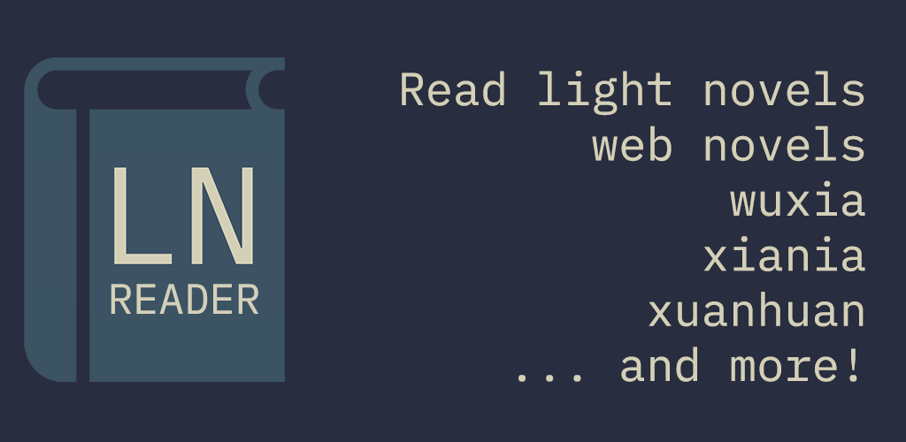
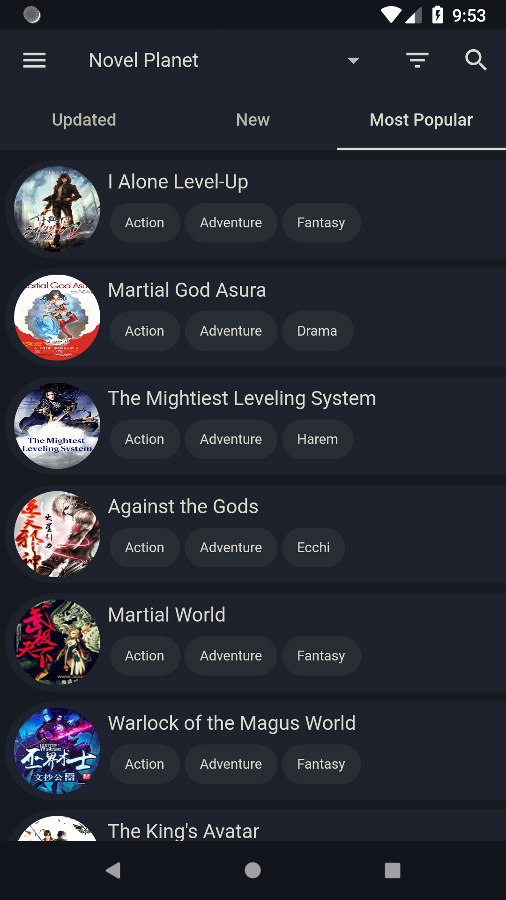
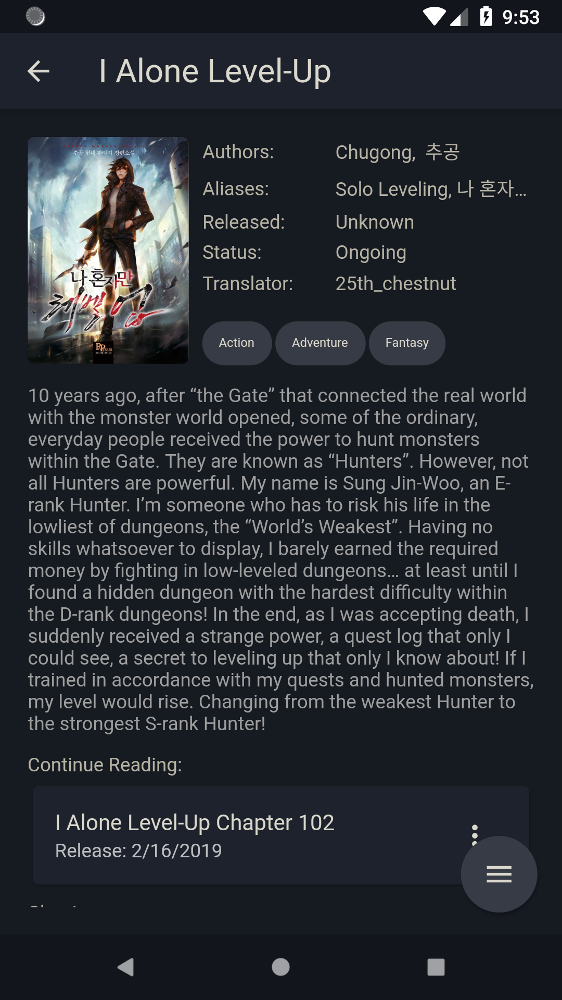
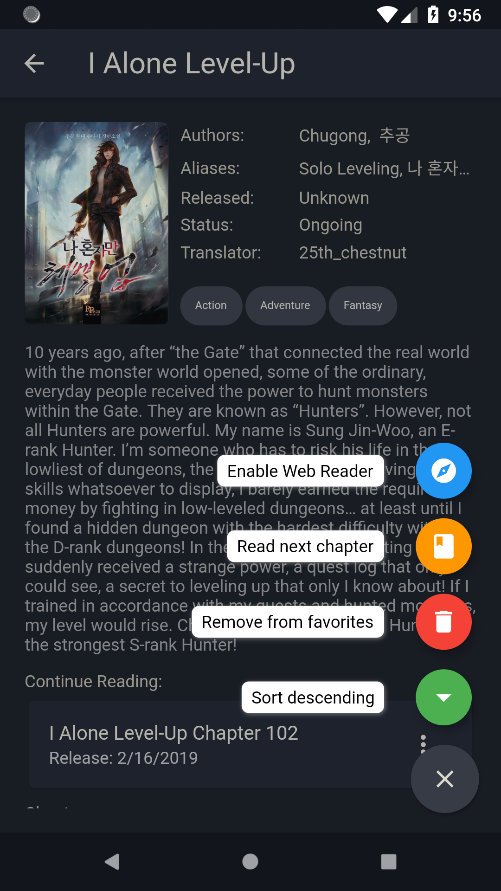
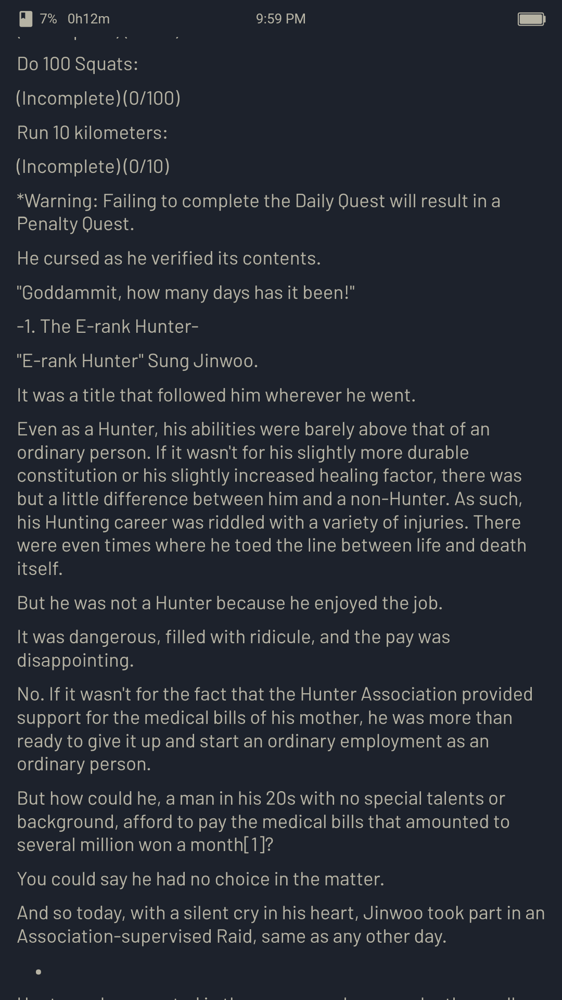
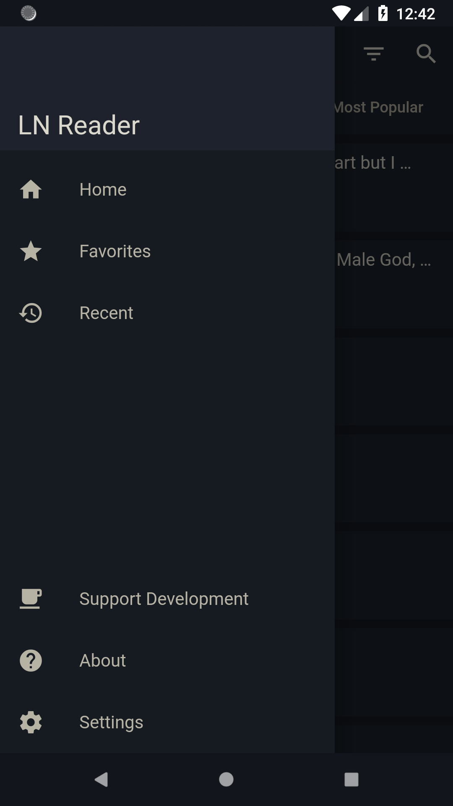
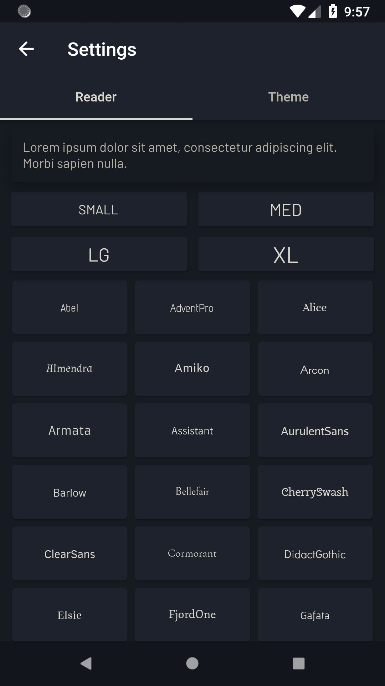
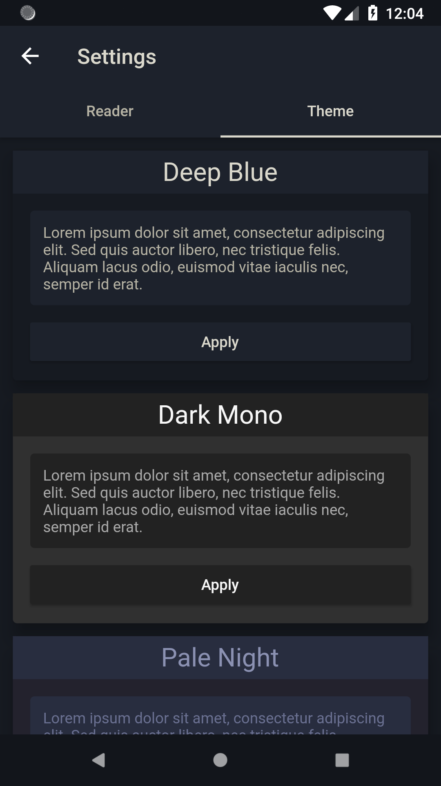

# LNReader

Works on both iOS and Android thanks to [Flutter](https://flutter.dev/)

## Screenshots

  
  
  
  
  
  
  

## Roadmap

Currently the application core is pretty much entirely finished and fleshed out.

I do plan to eventually add a few more things that can already be done in some way:
- Notifications upon a 'favorite' being updated
    - NovelUpdates is a thing (subscribe to RSS)
- Saving for offline reading
    - One can open a chapter in an external browser already and use another app for downloading the page

Add more sources
- Current only NovelPlanet is supported

## Open Source

As this application is entirely open source, feel free to make any PRs or suggestions that you think should be added!